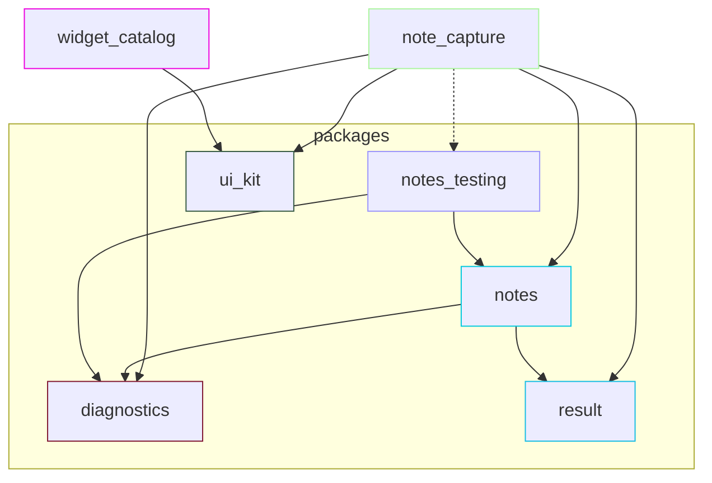

# Module dependencies

Generated by `dart run melos run graph`. Do not edit manually. Arrows follow Melos dependency direction; this graph describes declared package dependencies, not runtime ownership.

